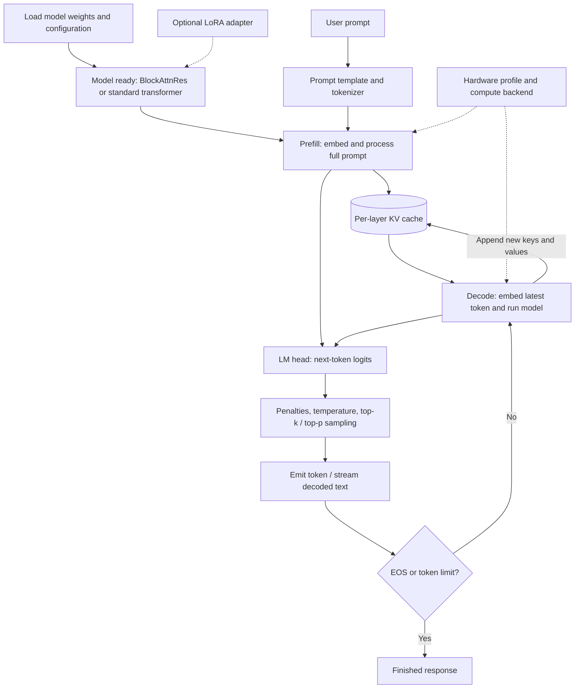
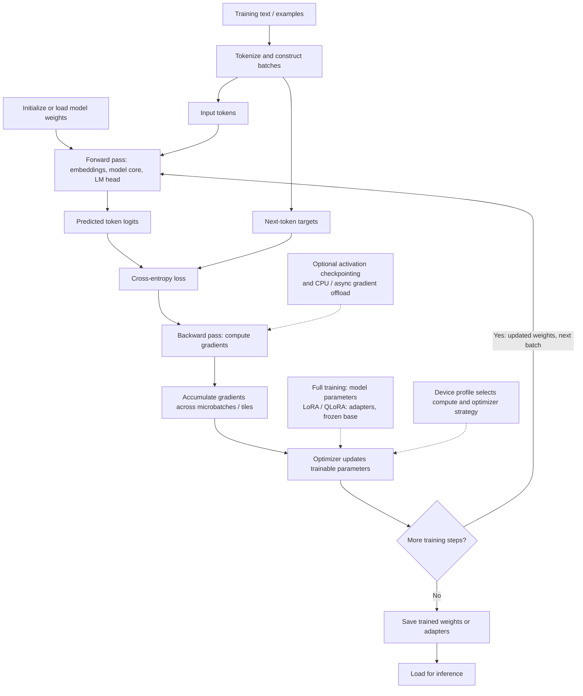

# FerrisRes: inference and training

High-level text-model flows. Dashed arrows denote optional configuration, not features enabled in every entry point.

## 1. Inference — use learned weights to generate output

**Model core:** the native model combines intra-block processing with inter-block representation attention; MoE variants route to selected experts. Standard-transformer compatibility uses its own layer implementation. Model weights stay fixed during ordinary inference; the KV cache changes as tokens are generated.

Optional vision/audio encoders and modality-specific output heads are separate paths, omitted here to keep the text generation loop clear. Retrieval, tool execution, and Armor depend on the selected application path; they are not universal stages of `UnifiedTokenGenerator`.

## 2. Training — update parameters from prediction error

This is the conceptual supervised next-token training flow, not a claim that every training entry point uses the same orchestrator. Batch input and targets advance on each loop iteration. Optimizer implementations include SGD, Adam, SCALE, and AdaMeM; selection depends on the path and configuration. QLoRA keeps the quantized base frozen and trains low-rank adapters. Distillation is an alternative training path using teacher supervision, not a required stage of this diagram.

## Source references

- `src/inference/unified_generator.rs`: prefill, LM head, sampling, cache updates, decode and stop conditions.
- `src/model/model.rs`: native intra-block and inter-block forward processing.
- `src/model/dispatcher.rs`: model-specific dispatch.
- `src/training/mod.rs`: training state, optimizer exports, checkpointing and offload configuration.
- `src/training/optimizer.rs`: optimizer and cross-entropy implementations.
- `src/training/lora.rs`, `src/training/qlora.rs`: adapter training components.
- `README.md`: broader architecture and optional modalities.
